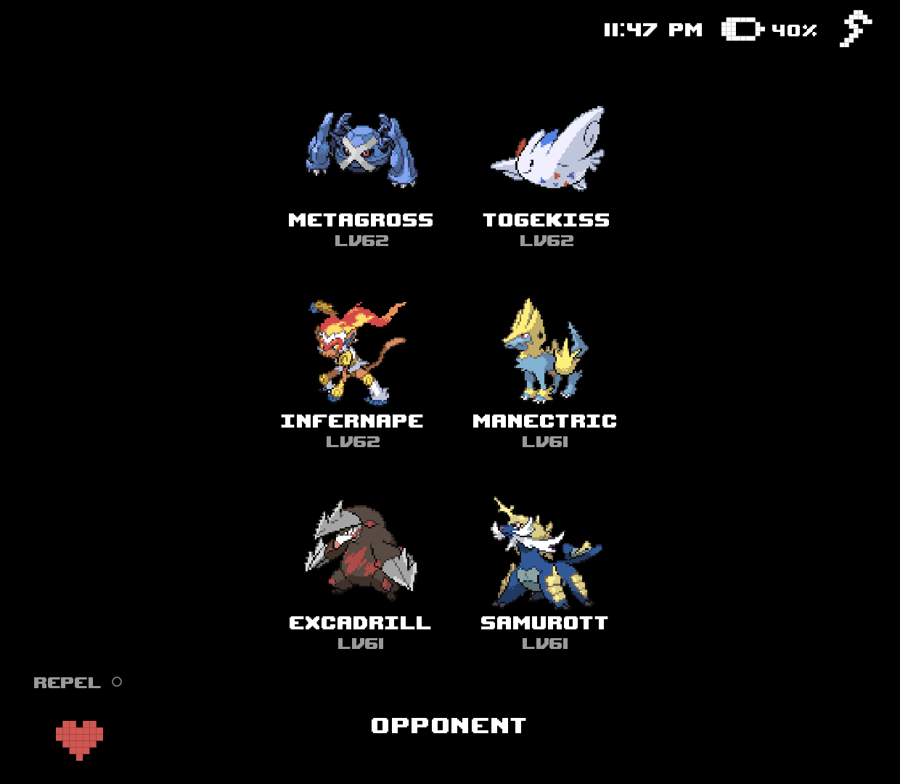
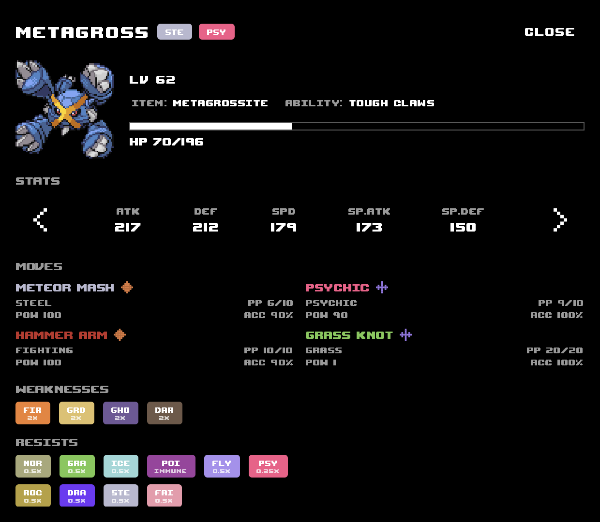
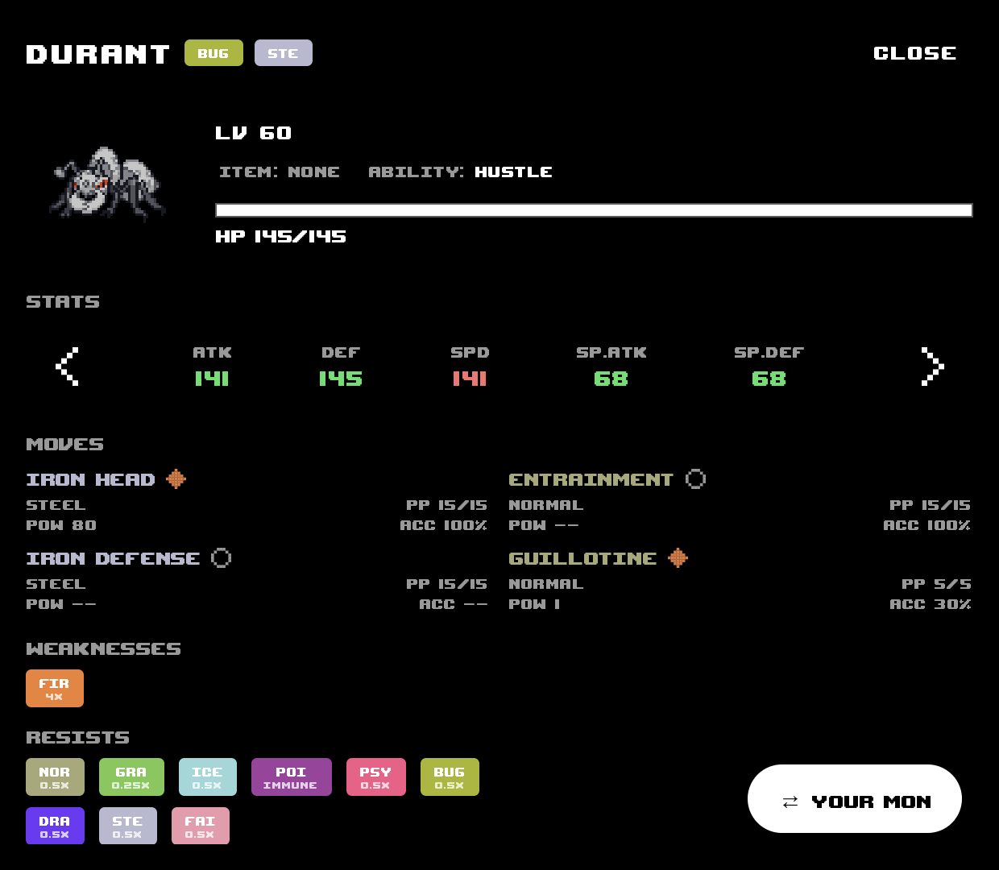
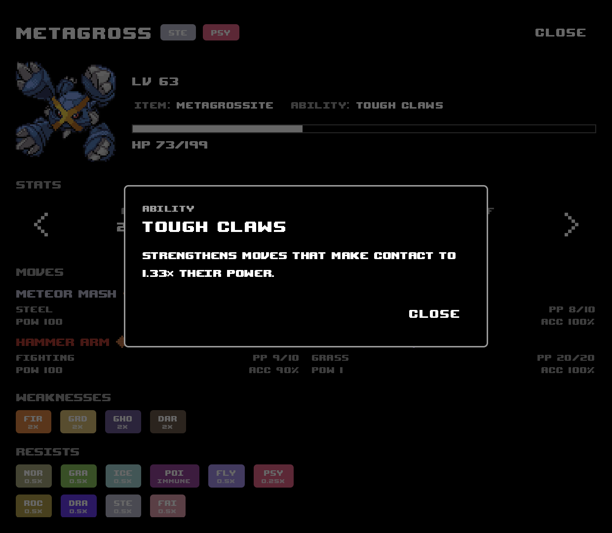

# GBA Pal

An Android companion app for GBA Pokemon games and ROM hacks. It reads live
game memory straight out of RetroArch while you play and mirrors your run on
a second screen — your party, whoever you're fighting, and a full detail view
for any Pokemon, all updating in real time as the battle happens. Built for
dual-screen handhelds like the Ayn Thor, but it works fine as a normal
single-screen app too — run it on a phone next to your emulator.

<p>
  
  &nbsp;&nbsp;
  
</p>
<p>
  
  &nbsp;&nbsp;
  
</p>

## Features

- **Hub** — your live party at a glance: sprites, nicknames, levels, and HP,
  polled straight from game memory.
- **Auto opponent view** — pops open the moment a battle starts and closes
  itself once it's over, no manual switching. Shows the enemy's whole team,
  not just whichever one is currently out.
- **Pokemon detail** — stats, full moveset with PP/power/accuracy and a
  physical/special/status icon per move, held item, ability, and type
  weaknesses/resistances, for any Pokemon on either side.
- **Stat compare** — an opponent's stats are coloured red where they beat
  your active Pokemon and green where they lose, live stat stage changes
  (that Swords Dance, that Intimidate) included.
- **Tap-to-describe Pokedex** — tap a Pokemon's name, ability, held item, or
  any move for what it actually does, including how that Pokemon evolves.
  Looked up once, cached on the device, works offline after that.
- **Quick actions** — a heal button (full HP and PP, blocked mid-battle so
  it can't be used as a move) and an infinite Repel toggle, both optional
  from Settings.
- Pure black-and-white, OLED-friendly theme. The only colour on screen is
  Pokemon type colour.

## Supported games

Currently bundled: **Pokemon Unbound**, **Radical Red**, **Emerald
Imperium**, **Emerald Rogue**.

Games are recognised by the ROM file's CRC32 and read using a small **game
profile** — one JSON file per game describing where that ROM keeps its data,
which the app then reads live out of the loaded ROM. Nothing about the app is
tied to a particular ROM base, and adding a game needs no app code — see
[docs/game-profiles.md](docs/game-profiles.md).

## Setting it up

1. **Install [RetroArch](https://www.retroarch.com/)** and get the **mGBA**
   core through its core downloader.
   > The Network Command Interface this app relies on is fairly recent —
   > if it doesn't seem to be working, grab RetroArch's
   > [nightly build](https://buildbot.libretro.com/nightly/) instead of
   > the stable release. Stable should catch up eventually.
2. In RetroArch: **Settings → Network → Network Commands** → enable it,
   port `55355`.
3. Load one of the supported games with the mGBA core.
4. Install GBAPal (see [Releases](../../releases)) and open it. It finds
   RetroArch automatically and starts tracking your party — no setup inside
   the app itself.

If GBAPal is on a different device than RetroArch (a second screen, a
handheld's other display), both just need to be reachable over the same
network.

## Building from source

```
./gradlew assembleDebug   # debug build
./gradlew assembleRelease # release build
```

`assembleRelease` is signed with the keystore committed at
`keystore/release.keystore`. That's intentional, not an oversight — this is
a personal, read-only companion app with nothing sensitive in it, and a
fixed key is what lets Obtainium/sideloaded updates install in place instead
of forcing an uninstall each time. Override it with Gradle properties
(`-PreleaseStoreFile=... -PreleaseStorePassword=...`) if you'd rather sign
with your own.

## Installing updates via Obtainium

Add this repo to [Obtainium](https://github.com/ImranR98/Obtainium) as a
GitHub source to track and auto-update from [Releases](../../releases).

## About the AI in this

I built this with a lot of help from AI — I don't have real software
development experience, and this app wouldn't exist without it. I wanted
something like this for my own Pokemon ROM hack playthroughs, and once it
was working, it seemed worth sharing rather than keeping to myself. If
nobody else ever uses it, that's fine — I built it for me first, and I'll
keep using and improving it either way. I'd just rather be upfront about how
it was made than pretend otherwise.
