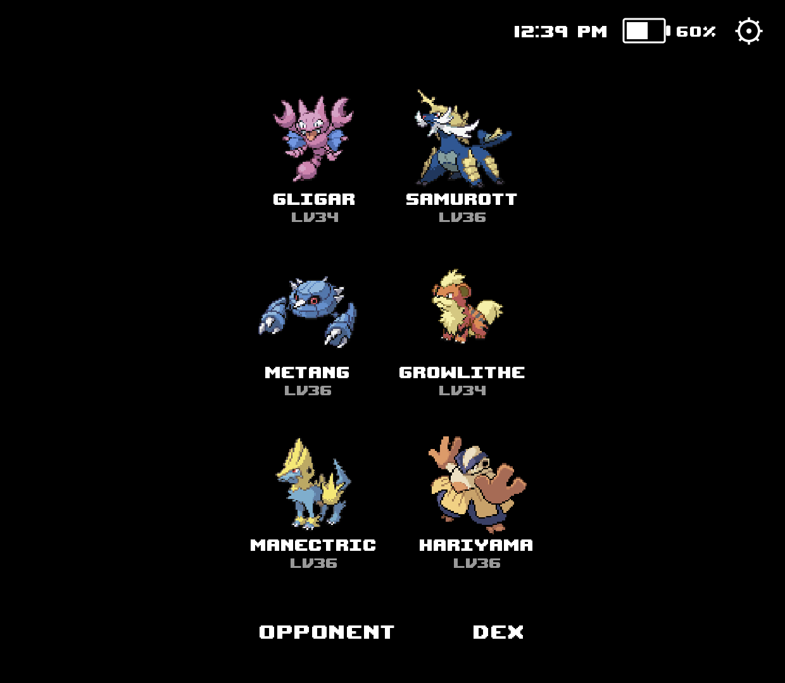
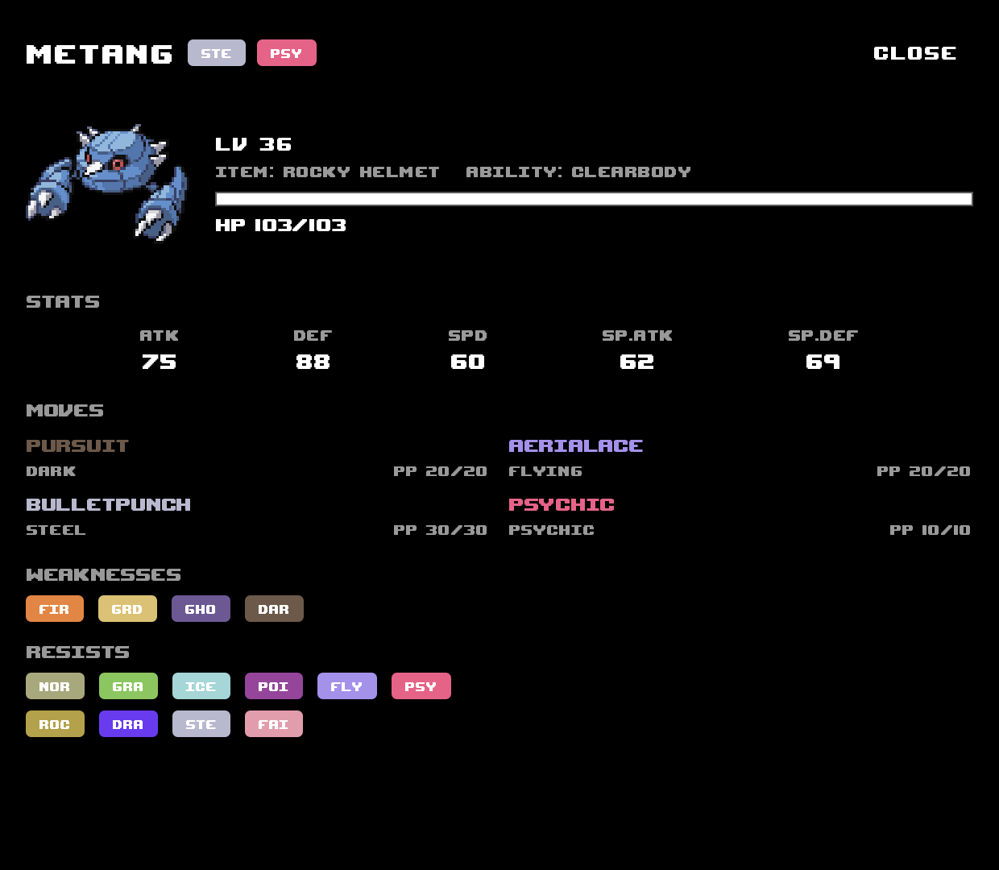

# GBA Pal

Android companion app for Pokemon Unbound (GBA), running via RetroArch's
mGBA core. It talks to RetroArch's Network Command Interface (UDP, default
port `55355`) to read live game memory and mirrors your run on a second
screen: your party, the current opponent, and a detail view for every
Pokemon. Built for dual-screen handhelds like the Ayn Thor, but works as a
normal single-screen app too.

<p>
  
  &nbsp;&nbsp;
  
</p>

## Features

- **Hub** — your live party at a glance: sprites, nicknames, and levels,
  polled straight from game memory.
- **Auto opponent view** — pops open automatically when a battle starts and
  returns to the hub once the battle ends, no manual switching needed.
- **Pokemon detail** — stats, full moveset with PP, held item, ability, and
  type weaknesses/resistances for any party or opponent Pokemon.
- Pure black-and-white OLED-friendly theme — the only colour on screen is
  Pokemon type colour.

## Building

```
./gradlew assembleDebug   # debug build
./gradlew assembleRelease # release build
```

`assembleRelease` is signed with the keystore committed at
`keystore/release.keystore`. It's intentionally not a secret — this is a
personal, read-only companion app with nothing sensitive in it. The only
reason it's fixed is so Obtainium/sideloaded updates install in place
instead of forcing an uninstall (which a changing signature would require).
If you ever want a private key instead, override it with Gradle properties
(`-PreleaseStoreFile=... -PreleaseStorePassword=...` etc.) without touching
the committed defaults.

## Using with RetroArch

1. In RetroArch: **Settings → Network → Network Commands** → enable, port
   `55355`.
2. Load Pokemon Unbound with the mGBA core.
3. Install this app on the same device (or a second screen) — the hub
   connects automatically and starts tracking your party.

## Usage of AI

  AI was obviously used to make this app. I by no means have any real coding experience, this is simply something I personally wanted to build
  for my playthroughs of Pokemon Rom Hacks and thought others may enjoy using it too.

## Installing updates via Obtainium

Public releases are cut manually (not on every push to `main`), so the
public build only ever advances when something is actually ready to ship.
Add this repo to [Obtainium](https://github.com/ImranR98/Obtainium) as a
GitHub source to track and auto-update from those releases (tag
`v1.0.<release number>`). Private test builds (also triggered manually, for
testing only) are published as draft releases, which stay off the public
releases page and out of Obtainium's feed.
